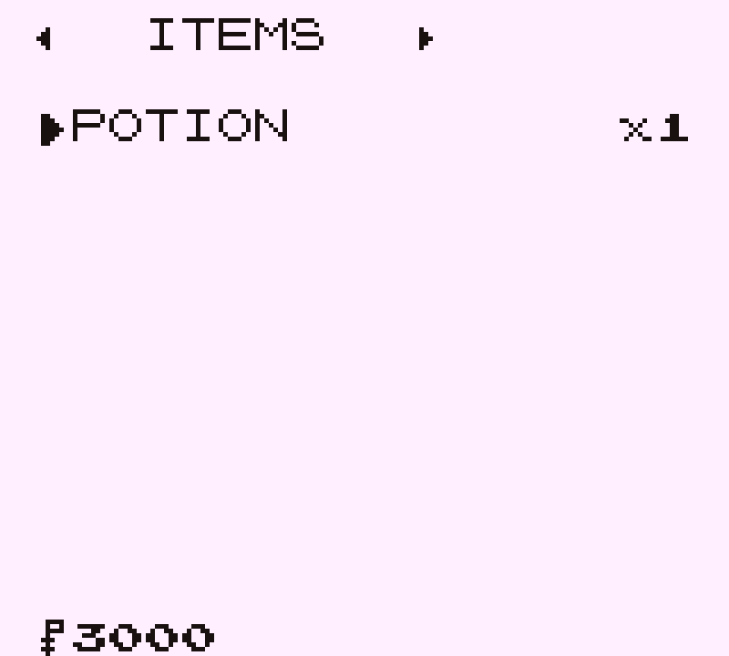
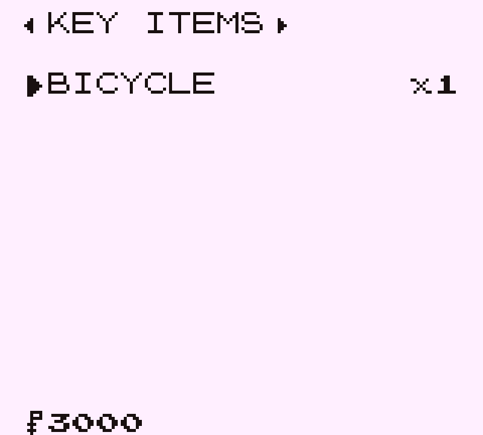

**A bag overhaul for the [Pokémon Gen 1 Recompilation Project](https://github.com/bryanthaboi/pokemon-gen1-recomp-project).**

Four Gen 2 pockets paged with Left and Right · acquisition order kept · the SELECT swap still works

  
  
  

---

PokeBag+ splits the bag into four pockets -- ITEMS, BALLS, KEY ITEMS and
TM/HM -- paged with Left and Right, in the style the Game Boy would have
shipped. It keeps the vanilla 20 slot limit, keeps acquisition order, and
keeps SELECT working, now confined to the pocket you are in.

   
  The header shares its left and right borders with the bag window, and its bottom border is that window's top edge

   
  KEY ITEMS, the longest of the four names, still clear of both arrows

The arrows are drawn by hand rather than taken from the font. The charmap
has a filled right arrow and no left one, and a glyph beside a hand-drawn
cousin reads as mismatched, so both sides are drawn the same way.

## Try it

    cmd /c mklink /J game\mods\pokebag_plus <path to this repo>
    cd game && luajit mods/pokebag_plus/tests/pokebag_plus_test.lua
    cd game && python tools/modkit.py validate mods/pokebag_plus --base imported

## What changes

- The bag is four pockets instead of one flat list. Left and Right page
  between them from anywhere in the list, and the bag reopens on whichever
  pocket you used last.
- SELECT still picks an item up and places it, the way vanilla's bag does.
  It now works inside the pocket you are in.
- Acquisition order is untouched. Nothing sorts itself.
- The battle bag is the same four pockets, so there is one thing to learn
  rather than two.

## What does not change

The save. Pockets are a view over the item list the game already keeps, so
this mod adds no save field and changes no format. Uninstalling it leaves
the flat vanilla bag exactly as it was.

## Options

`BAG SLOTS`, in the mod manager, is 20 by default -- the vanilla limit.
Setting it to 999 lifts the cap on how many distinct items the bag holds.
See Limits below before raising it: past 20 it makes `.sav` export lossy.

## Limits

- Raising the slot limit above 20 makes `.sav` export lossy. The Game Boy
  bag format holds 20 entries, so converting a save keeps the first 20 in
  acquisition order and drops the rest. At the default setting this cannot
  happen.
- The 99 per-stack cap is the engine's and is unchanged. The option controls
  how many distinct items fit, not how many of each.
- 999 is effectively unlimited rather than literal: vanilla has 144
  non-badge items, so that is the real ceiling until a content mod adds more.

## Licence

MIT.
