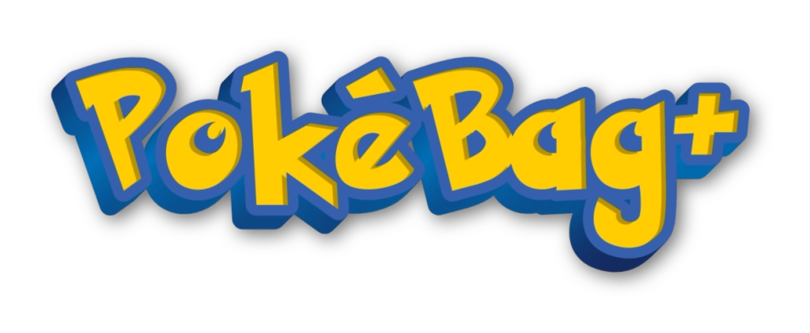
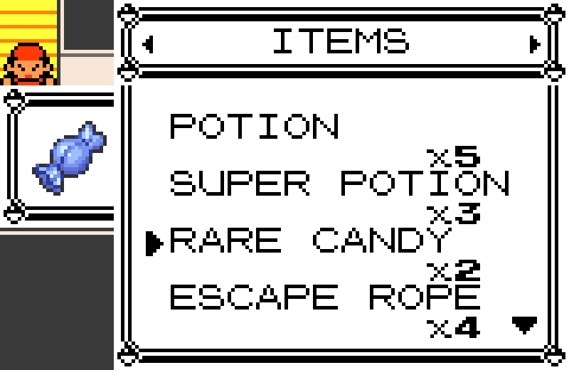
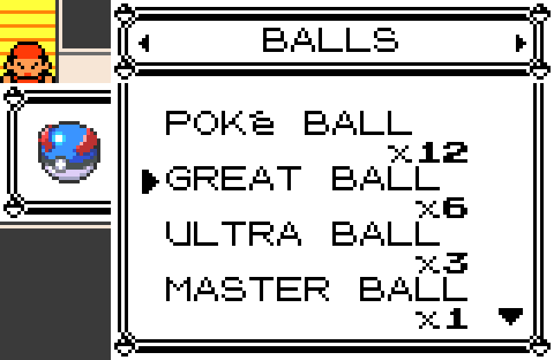
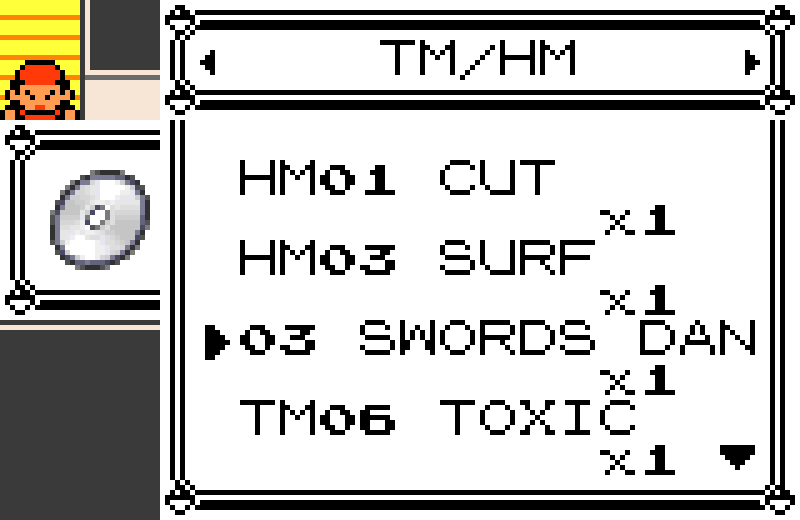
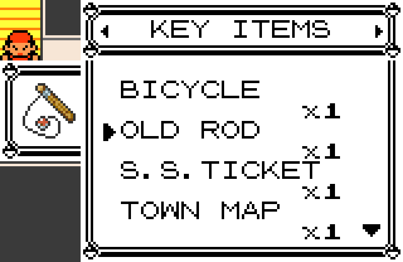

**A bag overhaul for the [Pokémon Gen 1 Recompilation Project](https://github.com/bryanthaboi/pokemon-gen1-recomp-project).**

Four Gen 2 pockets paged with Left and Right · TM and HM move names · an item preview window · the vanilla 20 slot limit and SELECT swap kept

  
  
  

---

PokeBag+ splits the bag into four pockets -- ITEMS, BALLS, KEY ITEMS and
TM/HM -- paged with Left and Right, in the style the Game Boy would have
shipped. It keeps the vanilla 20 slot limit, keeps acquisition order in three
of the four pockets, and keeps SELECT working, now confined to the pocket you
are in. The TM/HM pocket is grouped and shows move names by default; both can
be turned off.

   
  The header shares its left and right borders with the bag window, and its bottom border is that window's top edge. The window on the left is the item preview.

   
  BALLS, with the highlighted Great Ball in the preview. The window only appears with a Gen 3 import

   
  HMs first, then TMs by number. The highlighted name scrolls when it is wider than the list

   
  KEY ITEMS, the longest of the four names, still clear of both arrows. The preview follows the highlighted item

The arrows are drawn by hand rather than taken from the font. The charmap
has a filled right arrow and no left one, and a glyph beside a hand-drawn
cousin reads as mismatched, so both sides are drawn the same way.

## Try it

    cmd /c mklink /J game\mods\pokebag_plus <path to this repo>
    cd game
    luajit mods/pokebag_plus/tests/pokebag_plus_test.lua
    luajit mods/pokebag_plus/tests/pocket_bag_test.lua
    luajit mods/pokebag_plus/tests/pockets_test.lua
    luajit mods/pokebag_plus/tests/header_test.lua
    luajit mods/pokebag_plus/tests/marquee_test.lua
    luajit mods/pokebag_plus/tests/preview_test.lua
    python tools/modkit.py validate mods/pokebag_plus --base imported

## What changes

- The bag is four pockets instead of one flat list. Left and Right page
  between them from anywhere in the list, and the bag reopens on whichever
  pocket you used last.
- SELECT still picks an item up and places it, the way vanilla's bag does.
  It now works inside the pocket you are in.
- Acquisition order is untouched in ITEMS, BALLS and KEY ITEMS. The TM/HM
  pocket is grouped by default (see `GROUP TM/HM`).
- The TM/HM pocket shows each machine's move (`TM01 MEGA PUNCH`), lists HMs
  before TMs, and scrolls a name that is too wide for the list.
- A small window beside the list previews the highlighted item's icon, when
  you have a Gen 3 game imported.
- The battle bag is the same four pockets, so there is one thing to learn
  rather than two.

## What does not change

The save. Pockets are a view over the item list the game already keeps, so
this mod adds no save field and changes no format. Uninstalling it leaves
the flat vanilla bag exactly as it was.

## Options

`BAG SLOTS`, in the mod manager, is 20 by default -- the vanilla limit.
Setting it to 999 lifts the cap on how many distinct items the bag holds.
See Limits below before raising it: past 20 it makes `.sav` export lossy.

`TM/HM NAMES` is on by default: the TM/HM pocket shows `TM01 MEGA PUNCH`.
Names wider than the list are cut with a trailing dot, and the highlighted
row scrolls so you can read it in full. Off shows a machine as `TM01`, like
vanilla.

`ITEM PREVIEW` is on by default: the highlighted item's icon shows in a small
window attached to the left of the list. TMs show a disc matching their move's
type, and an item with no icon of its own shows Gen 3's question mark.

The icons are Gen 3's and are read from your own import, so **the window only
appears once you have imported FireRed, LeafGreen or Emerald** in the game's
launcher (IMPORTERS tab). Nothing is bundled with the mod. Without an import,
or with the option off, the bag looks exactly as it did before. Ruby and
Sapphire are not importable by the engine yet.

`GROUP TM/HM` is also on by default: the TM/HM pocket lists HMs first, then
TMs, each in number order, instead of the order you found them. Because that
order is sorted for you, SELECT does not pick an item up in that pocket while
it is on; the other pockets keep it. Off restores acquisition order and the
swap.

## Limits

- Raising the slot limit above 20 makes `.sav` export lossy. The Game Boy
  bag format holds 20 entries, so converting a save keeps the first 20 in
  acquisition order and drops the rest. At the default setting this cannot
  happen.
- The 99 per-stack cap is the engine's and is unchanged. The option controls
  how many distinct items fit, not how many of each.
- 999 is effectively unlimited rather than literal: vanilla has 144
  non-badge items, so that is the real ceiling until a content mod adds more.
- The preview draws Gen 3 art, not Gen 1 art, and always at its original size
  and colour. It is an addition beside the list, not part of the Gen 1 look.
- With `GROUP TM/HM` on, SELECT cannot reorder the TM/HM pocket, because its
  order is sorted for you. Turn the option off to move machines by hand.

## More mods by Code-Grub

Other mods for the Gen1Recomp project. Click a card to open its page.

<table>
  <tr>
    <td align="center" valign="top" width="33%">
       
      <a href="https://github.com/Code-Grub/bills-pc-plus"><b>Bill's PC+</b></a> 
      Free box paging, grab-and-place rearranging, and an inline art and stats panel.
    </td>
    <td align="center" valign="top" width="33%">
       
      <a href="https://github.com/Code-Grub/pokegear-menu"><b>PokéGear Menu</b></a> 
      A handheld START menu with a grid of apps, drawn in full colour.
    </td>
    <td align="center" valign="top" width="33%">
       
      <a href="https://github.com/Code-Grub/crystal-animated-sprites"><b>Crystal Animated Sprites</b></a> 
      Crystal's animated sprites in Red, Blue and Yellow, built from your own ROM.
    </td>
  </tr>
</table>

## Licence

MIT.
